```{r setup, include = FALSE, message = FALSE, warning = FALSE}
library(magrittr)
library(dplyr)
library(tibble)
library(ggplot2)
options(replace.assign  = TRUE, digits = 3, width = 120)
knitr::opts_chunk$set(
  fig.align  = "center",    # alignment for figures; left, right, center
  cache      = FALSE,       # should the chunk be cached?  
  eval       = TRUE,        # evaluate the chunk?
  comment    = NA,
  message    = FALSE,
  warning    = FALSE,
  cache.path = "cache/",    # the path for the cached chunks  
  include    = TRUE,        # should the chunk be included as output? 
  echo       = FALSE,       # should the chunk be echoed to the pdf? 
  fig.height = 6,
  fig.width  = 6,
  tidy       = FALSE        # should output be cleaned up? 
)
# This is good for getting the ggplot background 
# consistent with the html background color
thm <- theme_bw() + 
  theme(
    panel.background = element_rect(fill = "transparent", colour = NA), 
    plot.background = element_rect(fill = "transparent", colour = NA),
    legend.position = "top",
    legend.background = element_rect(fill = "transparent", colour = NA),
    legend.key = element_rect(fill = "transparent", colour = NA)
  )
theme_set(thm)
```

class: inverse
background-image: url("figures/hold_on_to_your_hat.gif")
background-size: contain


---
# Who am I? 

.pull-left[
## Stu Field, Ph.D.
* Head R code developer
* Bioinformatics Scientist II
* Statistical tools
* Bioinformatics Dept.
* SomaLogic, Inc.

```{r whoami1, out.width = "75%", echo = FALSE}

```
]
.pull-right[
```{r tidy, out.width = "75%", echo = FALSE}
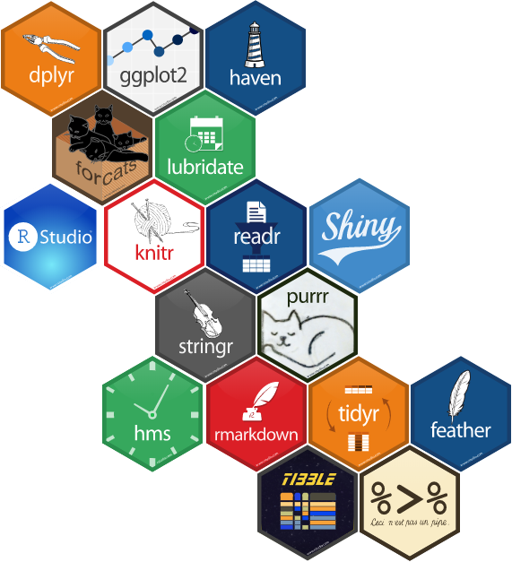
```
]


---
# What is SomaLogic? 

.pull-left[
* Proteomics company; Boulder, CO.
* Founded in 2000 by Larry Gold (Pioneer in aptamer research)
* Why Proteomics?

```{r proteomics, out.width = "60%", echo = FALSE}
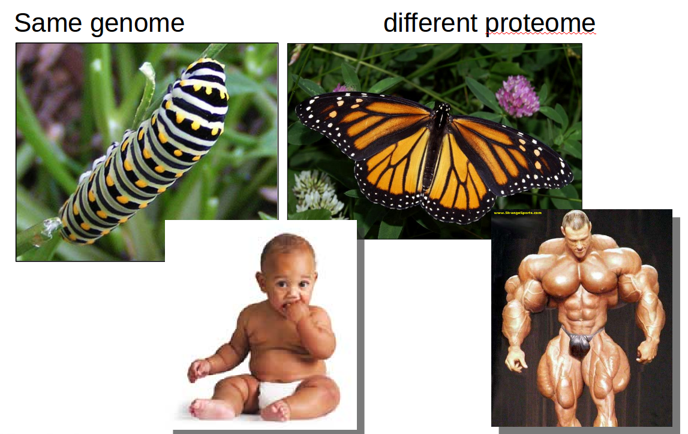
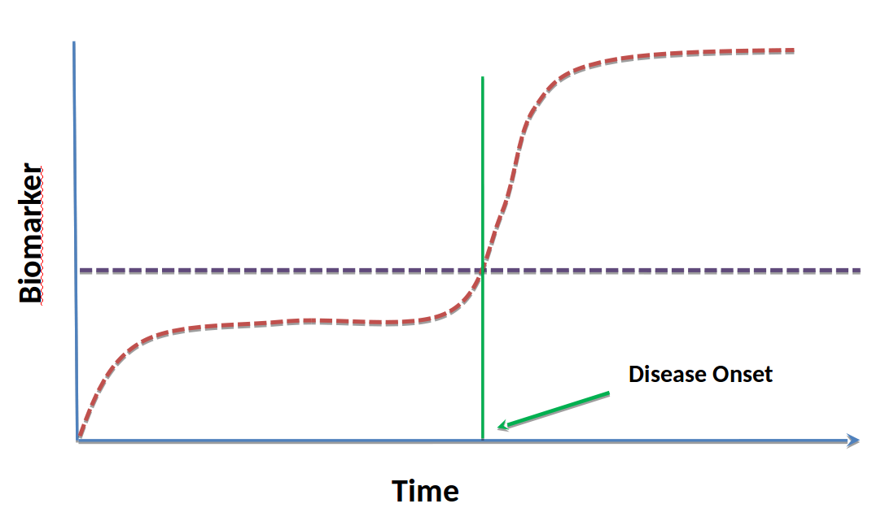
```
]
--
.pull-right[
`Magical` reagents called `SOMAmers`
```{r somamer, out.width = "50%", echo = FALSE}
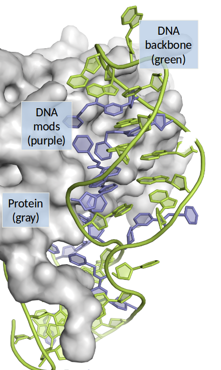
```
]


---
layout: false
class: inverse, center, middle
# What do I do?


---
# What do I do?     

.pull-left[
* Primarily looking for patterns in data:
  + reproducible
  + prediction
* Pattern recognition tool box:
  + Statistical Learning
  + Machine Learning
  + Deep Learning (?); AI (?)
* Statistical Computing Tools:
  + R
  + Python
  + Git, GitHub (https://github.com/stufield)
  + Linux OS; BASH
]
.pull-right[
.code70[
```{r example-plot-again, echo = TRUE, out.width = "75%", dev.args = list(bg = "transparent")}
ggplot(mtcars, aes(x = disp, y = mpg)) + 
  geom_point() +
  geom_smooth(method = "loess")
```
]
]


---
layout: false
class: inverse, middle, center

# How did I get here?


---
# Took the long way 

.pull-left[
* University of Guelph, Ontario, Canada
  + Bachelor Environmental Sciences (B.Sc. env)
  + Eerie similarities with CSU
  
```{r guelph, out.width = "75%", echo = FALSE}
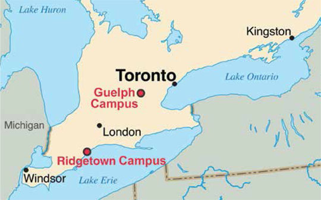
```
]

???
This is a note to self ... or is it?


---
# Auf nach Deutschland mit Dir! 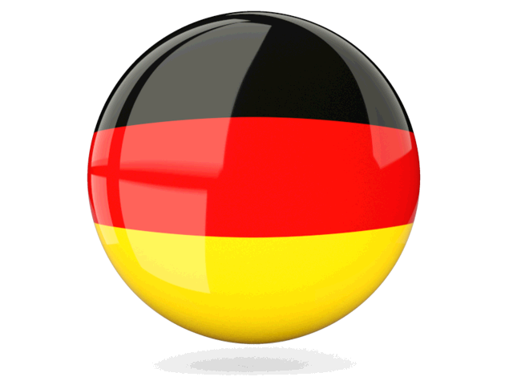

.pull-left[
University of Münster, Germany
```{r germany, out.width = "60%", echo = FALSE}
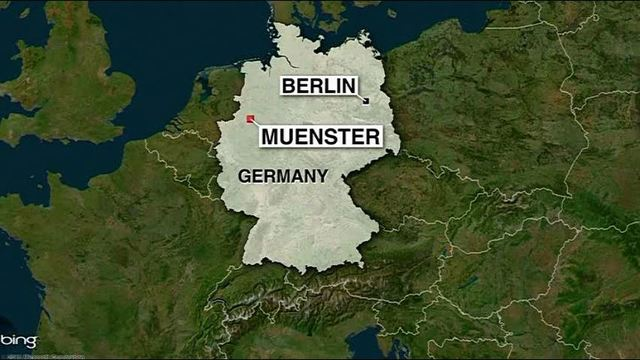
```
```{r germany2, out.width = "55%", echo = FALSE}
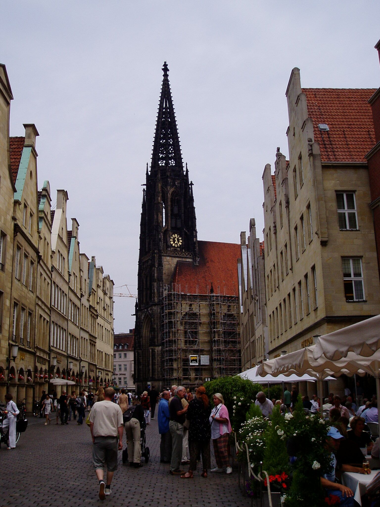
```
]
--
.pull-right[
* Ph.D. Disease Ecology & Host-Parasite Interaction
  + Earthworms "makin' love"

```{r worms, out.width = "75%", echo = FALSE}
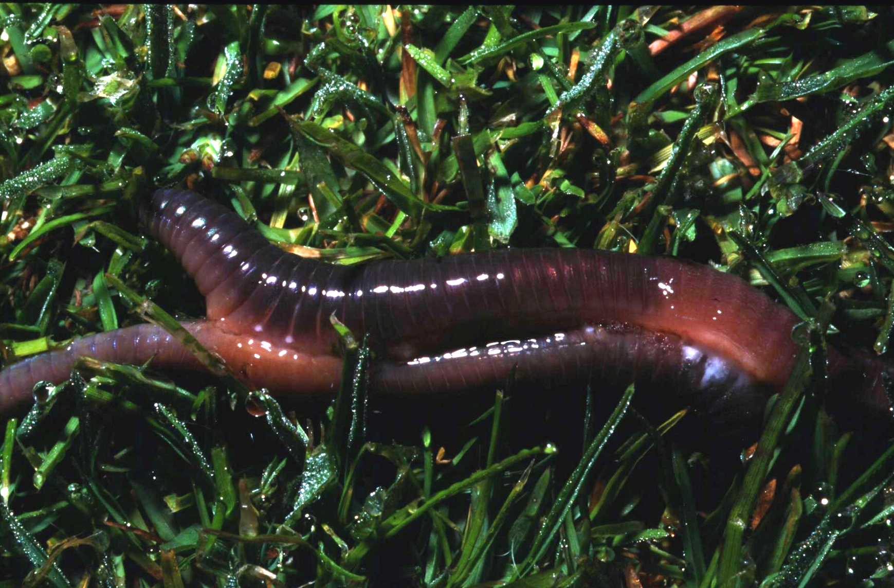
```

]


---
class: inverse
background-image: url("figures/katrina.gif")
background-size: contain
# Short Stop Back in NoLa 


---
# Rocky Mountain High! 

.pull-left[
* Colorado State University
  + Post-doc (Dr. Mike Antolin, Dr. Simon Tavener)
  + Modeling of disease
$$\vec x_1 = \vec x_0 * A \ \hspace{40pt} \ A = \begin{pmatrix} 0   & 0.1 & 0 \\ 0   & 0.1 & 0.9 \\ 0.5 & 0   & 0.95 \\ \end{pmatrix}$$

.code60[
```{r matrix, echo = TRUE}
x <- c(100, 50, 20)
A <- matrix(c(0, 0, 0.5, 0.1, 0.1, 0, 0, 0.9, 0.95), ncol = 3)
A
c(x %*% A)
```
]
]
.pull-right[
```{r wbp, out.width = "60%", echo = FALSE}
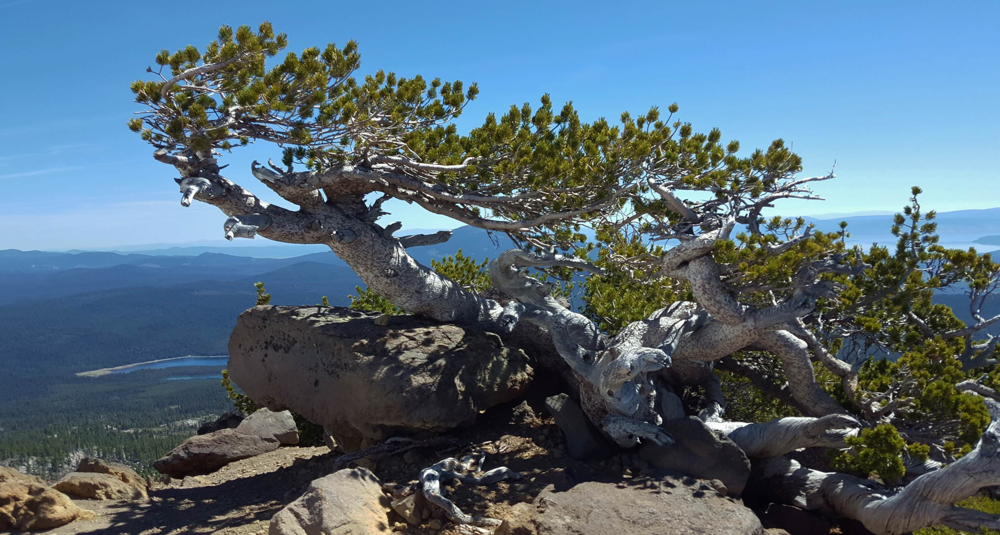
```
```{r project, out.width = "70%", echo = FALSE}
gen <- 25
out <- matrix(NA, nrow = gen, ncol = length(x))
out[1,] <- x
for (i in 2:gen) out[i, ] <- out[i - 1, ] %*% A
data.frame(out) %>%
  set_names(c("yearlings", "juveniles", "adults")) %>%
  reshape2::melt(value.name = "Pop_size",
                 variable.name = "class") %>%
  dplyr::mutate(time = rep(1:gen, 3)) %>%
  ggplot(aes(x = time, y = Pop_size, color = class)) +
    geom_line()
```
]


---
# Careers are like a box of chocolates ...

* Difficult to predict where you'll end up
* Be flexible
* Be curious
* Be open to alternatives
* Be ready when opportinity knocks ...

```{r gump, out.width = "80%", echo = FALSE}
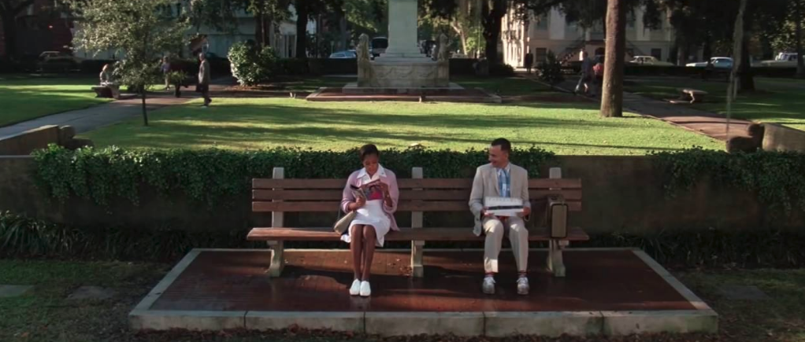
```


---
class: inverse
background-image: url("http://bit.ly/cs631-donkey")
background-size: cover
# Donkey in a hammock = I'm done!

