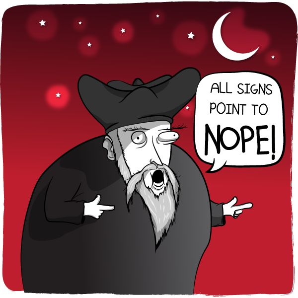

```{r setup, include = FALSE, message = FALSE, warning = FALSE}
library(magrittr)
library(dplyr)
library(tibble)
library(ggplot2)
options(replace.assign  = TRUE, digits = 3, width = 120)
knitr::opts_chunk$set(
  fig.align  = "center",    # alignment for figures; left, right, center
  cache      = FALSE,       # should the chunk be cached?  
  eval       = TRUE,        # evaluate the chunk?
  cache.path = "cache/",    # the path for the cached chunks  
  include    = TRUE,        # should the chunk be included as output? 
  echo       = FALSE,       # should the chunk be echoed to the pdf? 
  #fig.height = 7,
  #fig.width  = 7,
  tidy       = FALSE        # should output be cleaned up? 
)
# This is good for getting the ggplot background 
# consistent with the html background color
thm <- theme_bw() + 
  theme(
    panel.background = element_rect(fill = "transparent", colour = NA), 
    plot.background = element_rect(fill = "transparent", colour = NA),
    legend.position = "top",
    legend.background = element_rect(fill = "transparent", colour = NA),
    legend.key = element_rect(fill = "transparent", colour = NA)
  )
theme_set(thm)
```


# Outline

* Something
* Something else
* That other thing


---

layout: false
class: inverse, middle, center

# Heading Text

---

# Some Acronyms and Codes

.pull-left[
Test or code chunks for the lhs
]
.pull-right[
rhs bits
]

---

# Plot on the entire slide with a hex sticker   

```{r example-plot, fig.width = 6, fig.height = 5.5,  out.width = "40%", fig.align = "center", dev = "svg", dev.args = list(bg = "transparent")}
ggplot(mtcars, aes(x = disp, y = mpg)) + 
  geom_point()
```

---

# Plots on one side

.pull-left[
show some code here but don't make image:

```{r just_dont, eval = FALSE}
ggplot(mtcars, aes(x = disp, y = mpg)) +
  geom_point()
```
]
.pull-right[

```{r example-plot-again, echo = FALSE, fig.width = 6, fig.height = 5.5,  out.width = "90%", fig.align = "center", dev = "svg", dev.args = list(bg = "transparent")}
ggplot(mtcars, aes(x = disp, y = cyl)) + 
  geom_point()
```
]

---

# Insert images from file 

.pull-left[
Most statisticians say "no"
```{r nope, out.width = "450px", echo = FALSE}

```
]
.pull-right[
The Variance-Bias Trade-off
```{r varBias, out.width = "450px", echo = FALSE}
knitr::include_graphics("figures/VarBias.png")
```
]


---


# The Variance-Bias Trade-off 

.pull-left[
* Variance: Differences in model output performance when refitting slightly different data 
    * fits idiosyncrasies (noise) rather than signal 
    * model is too flexible
    * overfitting
]
.pull-right[
* Bias: lack of model performance due to model missing relationships between response and predictors
    * doesn't fit enough signal in the data
    * model is too rigid
    * underfitting
]

---

# The Packages of the tidyverse  

```{r tidyverse, out.width = "45%", echo = FALSE}
knitr::include_graphics("hex_images/tidyverse_all.png")
```

---

# Flow-Diagram of the Cross-validation process 

```{r xvalid, out.width = "75%", echo = FALSE}
knitr::include_graphics("figures/crossval-tree.png")
```


